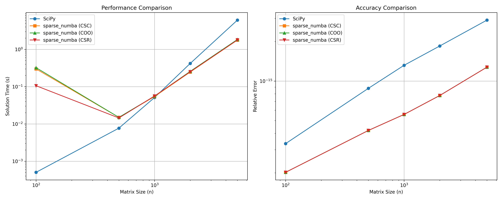
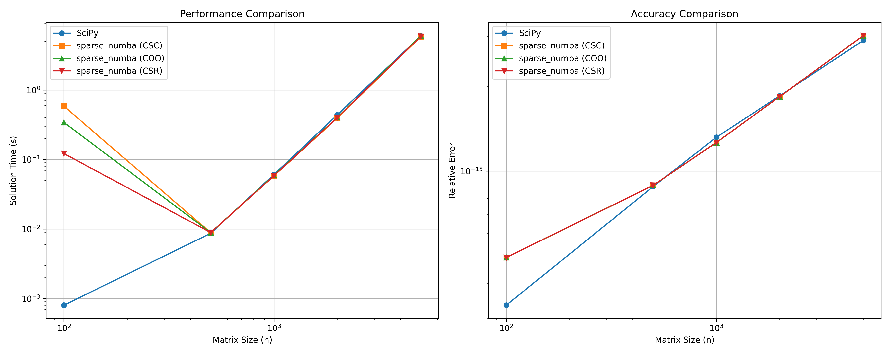
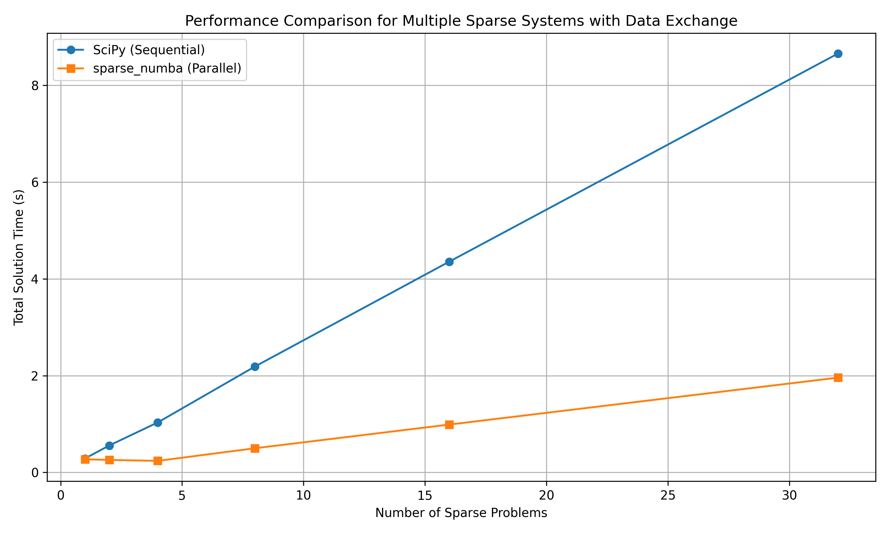
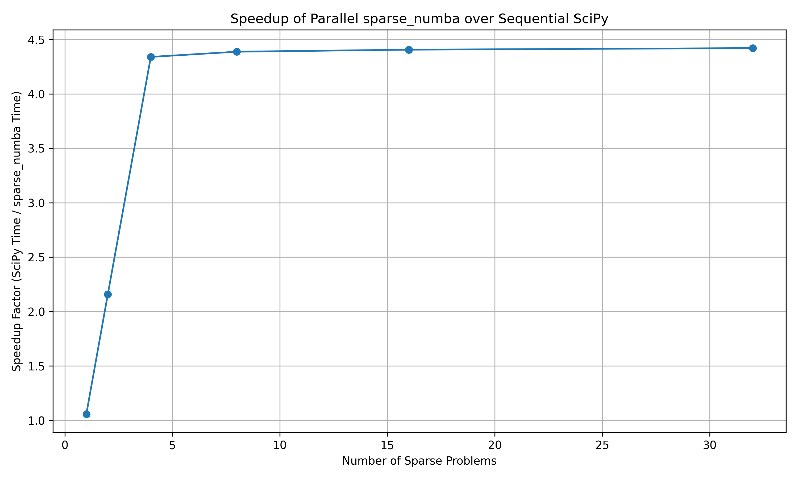
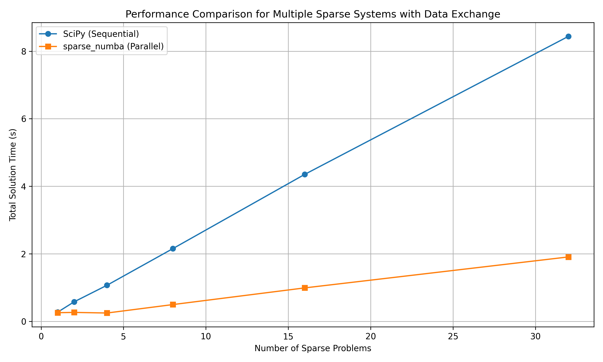
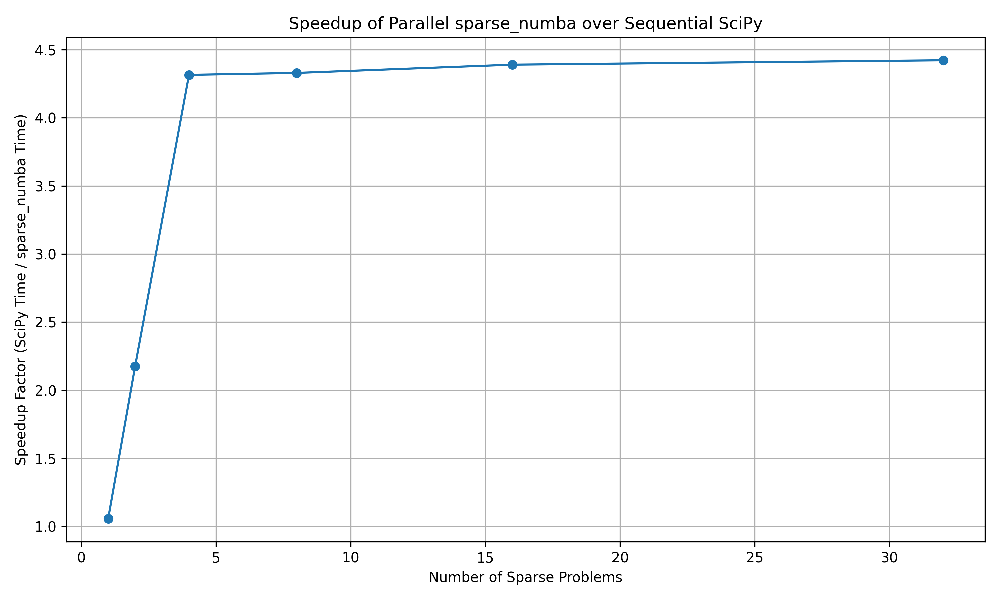

# Sparse_Numba

A lightweight, Numba-compatible sparse linear solver designed for efficient parallel computations in Python.

[](https://badge.fury.io/py/sparse-numba)
[](https://github.com/th1275/sparse_numba/actions)
[](https://pypi.org/project/sparse-numba/)

## Why Sparse_Numba?

Python is widely used for rapid prototyping and demonstration, 
despite its limitations in computationally intensive tasks. 
Existing sparse linear solvers (e.g., SciPy and KVXOPT) are efficient 
for single-task scenarios but face performance bottlenecks 
if there are frequent data exchanges and Python's Global Interpreter Lock (GIL).

Sparse_Numba addresses these limitations by 
providing a sparse linear solver fully compatible with 
Numba's Just-In-Time (JIT) compilation. 
This design allows computationally intensive tasks 
to run efficiently in parallel, bypassing Python's GIL 
and significantly improving multi-task solving speed.

## Installation

```bash
pip install sparse-numba
```
Due to the license issue, this package cannot include DLLs from umfpack. To run the existing function in this package, the user needs to install umfpack by yourself and add the necessary DLLs to the system path or put under: 
```
.venv/site-packages/sparse_numba/vendor/suitesparse/bin
```
Support for SuperLU solver has been added in the current version (0.1.6). Other solvers might be added soon. Sorry for this inconvenience.


### Installing from source (Windows)

If installing from source on Windows, you need to have MinGW installed and configured for Python:

1. Install MinGW-w64 (x86_64-posix-seh)
2. Add MinGW bin directory to your PATH
3. Create or edit your distutils.cfg file:
   - Location: `%USERPROFILE%\.distutils.cfg`
   - Content:
     ```
     [build]
     compiler=mingw32
     ```
4. Then:
 ```bash
python -m build --wheel
pip install dist/sparse_numba-%YOURVERSION%.whl
```
 

**Note:** Despite installing MinGW-w64 (64-bit), the compiler setting is still `mingw32`. This is the correct name for the distutils compiler specification and does not affect the bitness of the compiled extension.

Detailed installation information can be found [here](docs/Installation_Guide_for_sparse_numba.md).

## Usage

```python
import numpy as np
from sparse_numba import umfpack_solve_csc, superlu_solve_csc

# Example with CSC format (Compressed Sparse Column)
# Create a sparse matrix in CSC format
indptr = np.array([0, 2, 3, 6])
indices = np.array([0, 2, 2, 0, 1, 2])
data = np.array([1.0, 2.0, 3.0, 4.0, 5.0, 6.0])
b = np.array([1.0, 2.0, 3.0])

# Solve the linear system Ax = b
    # umfpack solver
x_umfpack = umfpack_solve_csc(data, indices, indptr, b)
print(x_umfpack)

    # superlu solver
x_superlu = superlu_solve_csc(data, indices, indptr, b)
print(x_superlu)

# More examples for COO and CSR formats...
```

## Performance Comparison

### Single Problem Performance

We compare the computational speed with 
SciPy for solving single problems of different sizes. 
The test result on an Intel Ultra 7 258V processor.
1. UMFPACK V.S. SciPy (spsolve):



2. SuperLU V.S. SciPy (spsolve):



### Multi-Task Performance

We compare the multi-task performance of Sparse_Numba with sequential SciPy.

3. UMFPACK V.S. SciPy (spsolve):

 


4. SuperLU V.S. Scipy (spsolve):

 


**Note:** The initialization time is included in these benchmarks. 
This is why the Numba-compatible function is initially slower, 
but the performance advantage becomes evident as parallelization takes effect.

## Features and Limitations

### Current Features
- UMFPACK solver integration with Numba compatibility
- SuperLU solver integration with Numba compatibility
- Support for CSC, COO, and CSR sparse matrix formats
- Efficient parallel solving for multiple systems

### Limitations
- The UMFPACK DLL files are not redistributed in this tool
- Other solvers are under development
- Performance may be limited for extremely ill-conditioned matrices
- **Only developed/tested for Windows**, the support for other platforms (Linux and MacOS) are added without testing

## Roadmap

This package serves as a temporary solution 
until Python's no-GIL and improved JIT features become widely available. 
At that time, established libraries like SciPy and KVXOPT will likely 
offer more comprehensive implementations with parallel computing features.

## License

BSD 3-Clause License

### License Statement of OpenBLAS:
DLL of OpenBLAS can be obtained from build: https://github.com/OpenMathLib/OpenBLAS
DLL of SuperLU can be obtained from build: https://github.com/xiaoyeli/superlu

## Citation

If you use Sparse_Numba in your research, you can consider to cite:

```
@software{hong2025sparse_numba,
  author = {Hong, Tianqi},
  title = {Sparse_Numba: A Numba-Compatible Sparse Solver},
  year = {2025},
  publisher = {GitHub},
  url = {https://github.com/th1275/sparse_numba}
}
```

## Contributing to Sparse_Numba

As an entry-level (or baby-level) developer, I still need more time to figure out the workflow. Due to my limited availability, this tool will also be updated very slowly. Please be patient. 

Thank you!
