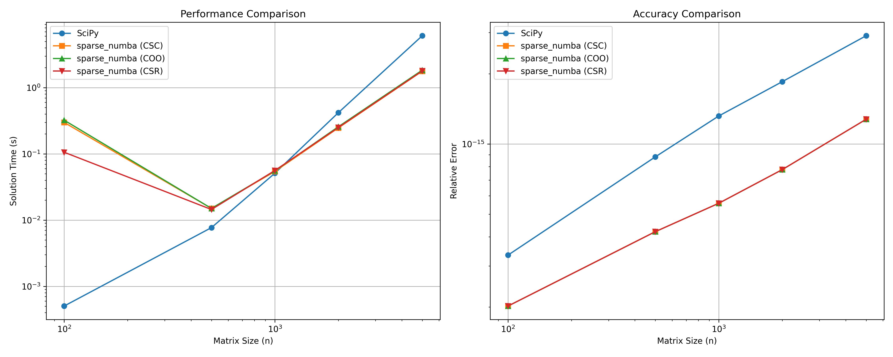
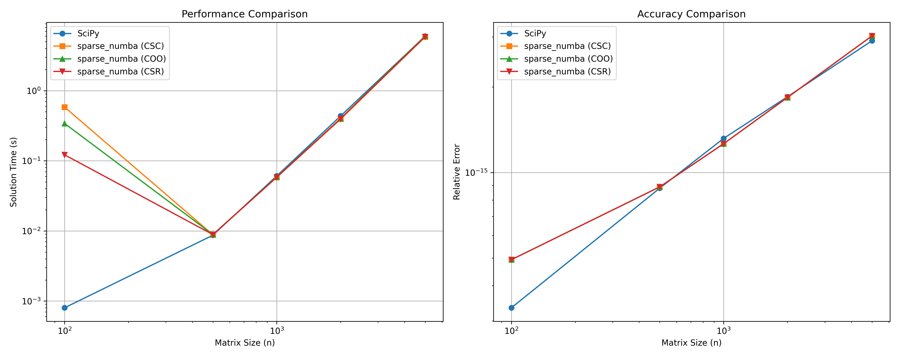
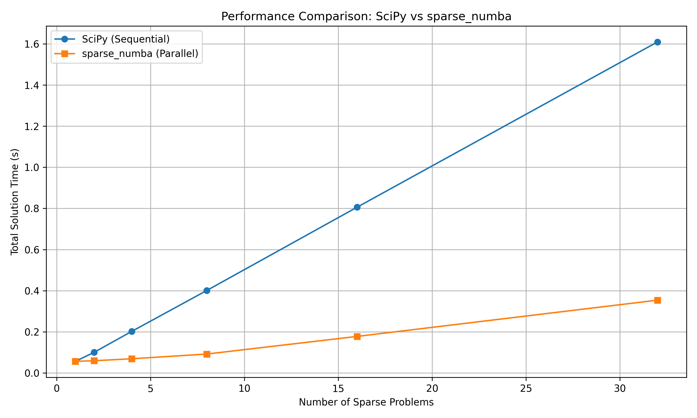
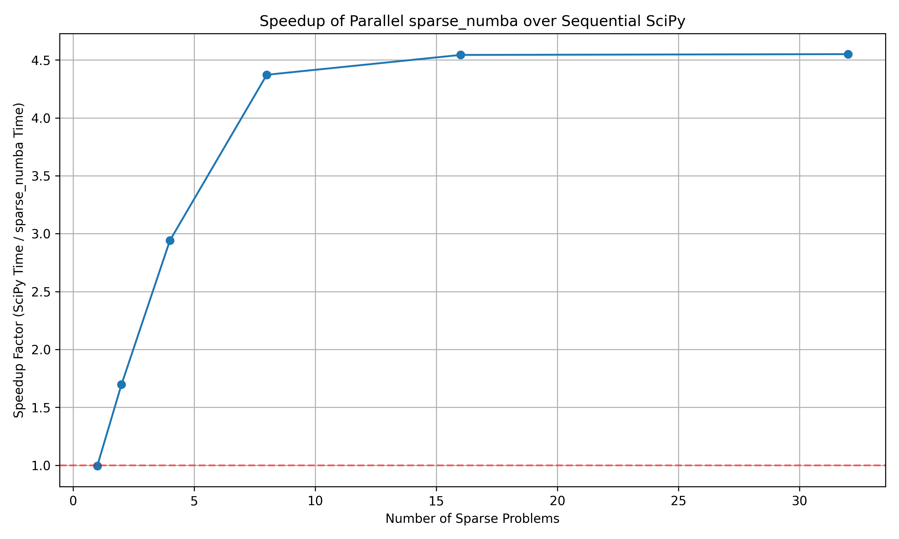
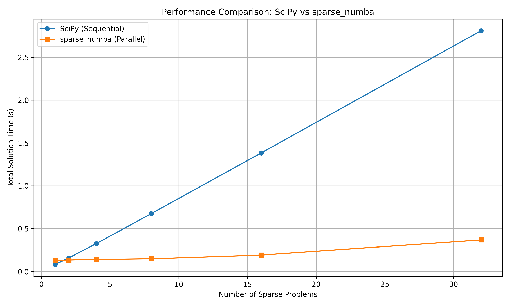
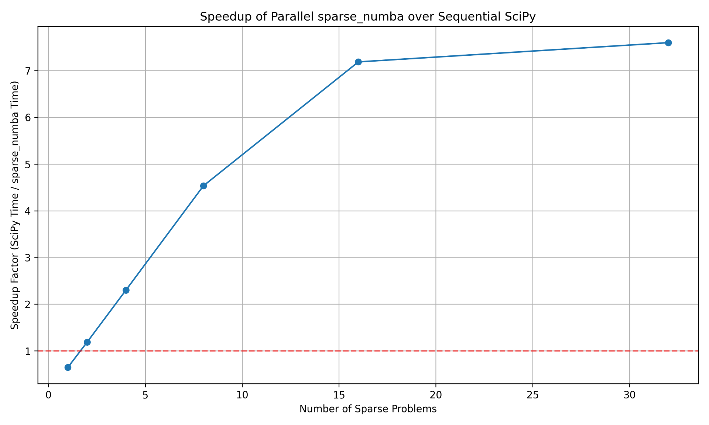

# Sparse_Numba

A lightweight, Numba-compatible sparse linear solver designed for efficient parallel computations in Python.

[](https://badge.fury.io/py/sparse-numba)
[](https://github.com/th1275/sparse_numba/actions)
[](https://pypi.org/project/sparse-numba/)

## Why Sparse_Numba?

Existing sparse linear solvers in Python (e.g., SciPy, CVXOPT, KVXOPT) work well for single-task scenarios but face performance bottlenecks due to frequent data exchanges and the Global Interpreter Lock (GIL). Sparse_Numba provides a sparse linear solver fully compatible with Numba's JIT compilation, allowing computationally intensive tasks to run in parallel by bypassing the GIL.

## Installation

```bash
pip install sparse-numba
```

Due to licensing, UMFPACK DLLs are not bundled. To use the UMFPACK solver, install SuiteSparse separately and add the DLLs to the system path or place them under:
```
.venv/site-packages/sparse_numba/vendor/suitesparse/bin
```

### Platform Compatibility

| Platform | Python Versions | Pre-built Wheels | Status |
|----------|----------------|-----------------|--------|
| Windows (x86_64) | 3.9 - 3.12 | Yes | Tested |
| Linux (x86_64) | 3.9 - 3.12 | Yes | Tested |
| macOS (ARM / Apple Silicon) | 3.9 - 3.12 | Yes | Tested |
| macOS (Intel x86_64) | 3.9 - 3.12 | Build from source | Supported |

> **Note:** Starting from v0.1.11, macOS pre-built wheels target Apple Silicon (ARM64).
> Intel Mac users can install from source: `pip install sparse-numba --no-binary=sparse-numba`.
> Python 3.8 support has been dropped to align with NumPy and Numba compatibility.

### Building from Source (Windows)

1. Install MinGW-w64 (x86_64-posix-seh) and add its `bin` directory to PATH.
2. Create `%USERPROFILE%\.distutils.cfg`:
   ```ini
   [build]
   compiler=mingw32
   ```
   Note: The setting is `mingw32` even for 64-bit builds.
3. Build and install:
   ```bash
   python -m build --wheel
   pip install dist/sparse_numba-<VERSION>.whl
   ```

To build only the SuperLU extension (skip UMFPACK if headers are unavailable):
```bash
SPARSE_NUMBA_SKIP_UMFPACK=1 python setup.py build_ext --inplace
```

Detailed installation information: [Installation Guide](docs/Installation_Guide_for_sparse_numba.md).

### Troubleshooting: `SIZEOF_VOID_P` Compilation Error (Windows)

When building from source on Windows with MinGW and Microsoft Store Python, you may encounter:

```
error: enumerator value for '__pyx_check_sizeof_voidp' is not an integer constant
```

This happens because the MS Store Python's `pyconfig.h` defines `SIZEOF_VOID_P=4` (32-bit) while MinGW compiles for 64-bit. Two fixes are needed:

1. **In the generated Cython C files** (`cy_superlu_wrapper.c`, `cy_umfpack_wrapper.c`), find:
   ```c
   enum { __pyx_check_sizeof_voidp = 1 / (int)(SIZEOF_VOID_P == sizeof(void*)) };
   ```
   Replace with:
   ```c
   //    enum { __pyx_check_sizeof_voidp = 1 / (int)(SIZEOF_VOID_P == sizeof(void*)) };
   enum { __pyx_check_sizeof_voidp = 1 };
   ```

2. **In `setup.py`**, the Windows `extra_compile_args` already includes `-DSIZEOF_VOID_P=8`. If building manually, add this flag to your `gcc` command.

Note: The pre-built wheels on PyPI do not have this issue.

## API Reference

### Solver Functions (Combined Factorize + Solve)

All functions are `@njit(nogil=True)` compatible for use inside Numba-compiled code.

| Function | Input Format | Description |
|----------|-------------|-------------|
| `superlu_solve_csc(data, indices, indptr, b)` | CSC | Factorize + solve in one call |
| `superlu_solve_csr(data, indices, indptr, b)` | CSR | Converts to CSC, then solves |
| `superlu_solve_coo(row, col, data, shape, b)` | COO | Converts to CSC, then solves |
| `umfpack_solve_csc(...)` | CSC | Same API, UMFPACK backend |
| `umfpack_solve_csr(...)` | CSR | Same API, UMFPACK backend |
| `umfpack_solve_coo(...)` | COO | Same API, UMFPACK backend |

**Return**: `(x: float64[:], info: int)` where `info=0` is success.

### Pre-Factorization API (Factorize Once, Solve Many Times)

For systems where the matrix `A` stays constant across many solves (e.g., linear ODE integration), pre-factorization avoids redundant LU decomposition. Factorize once, then solve with different right-hand side vectors.

| Function | Description |
|----------|-------------|
| `superlu_factorize_csc(data, indices, indptr)` | Factorize CSC matrix, return `(handle, info)` |
| `superlu_factorize_csr(data, indices, indptr)` | Factorize CSR matrix (converts to CSC internally) |
| `superlu_factorize_coo(row, col, data, shape)` | Factorize COO matrix (converts to CSC internally) |
| `superlu_solve_factored(handle, b)` | Solve using pre-computed factors, return `(x, info)` |
| `superlu_free_factors(handle)` | Free LU factor memory (must be called to avoid leaks) |
| `umfpack_factorize_csc(...)` | Same API, UMFPACK backend |
| `umfpack_factorize_csr(...)` | Same API, UMFPACK backend |
| `umfpack_factorize_coo(...)` | Same API, UMFPACK backend |
| `umfpack_solve_factored(handle, b)` | Same API, UMFPACK backend |
| `umfpack_free_factors(handle)` | Same API, UMFPACK backend |

**Note**: The `handle` is an opaque `int64` value. Each handle is independent and thread-safe. The user must call `free_factors()` when done.

### Sparse Utilities

| Function | Description |
|----------|-------------|
| `convert_coo_to_csc(row, col, data, n_rows, n_cols)` | COO to CSC conversion (handles duplicates) |
| `convert_csr_to_csc(data, indices, indptr)` | CSR to CSC conversion |
| `convert_coo_to_csr(row, col, data, n_rows, n_cols)` | COO to CSR conversion (handles duplicates) |
| `sparse_matvec_csr(data, indices, indptr, x)` | Sparse matrix-vector product `y = A @ x` |

## Usage Examples

### Basic Solve (Combined Factorize + Solve)

```python
import numpy as np
from sparse_numba.sparse_superlu.superlu_numba_interface import superlu_solve_csc

# CSC format sparse matrix
indptr = np.array([0, 2, 3, 6], dtype=np.int32)
indices = np.array([0, 2, 2, 0, 1, 2], dtype=np.int32)
data = np.array([1.0, 2.0, 3.0, 4.0, 5.0, 6.0])
b = np.array([1.0, 2.0, 3.0])

# Solve Ax = b
x, info = superlu_solve_csc(data, indices, indptr, b)
```

### Pre-Factorization (Factorize Once, Solve Many)

```python
from sparse_numba.sparse_superlu.superlu_numba_interface import (
    superlu_factorize_csc, superlu_solve_factored, superlu_free_factors
)

# Factorize once
handle, info = superlu_factorize_csc(A_csc.data, A_csc.indices, A_csc.indptr)
assert info == 0

# Solve many times with different RHS vectors
for b in list_of_rhs_vectors:
    x, info = superlu_solve_factored(handle, b)

# Free when done
superlu_free_factors(handle)
```

### Parallel Solving with Numba

```python
from numba import njit, prange

@njit(parallel=True)
def solve_many_systems(A_data, A_indices, A_indptr, rhs_list, n_systems):
    solutions = np.zeros((n_systems, len(rhs_list[0])))
    for i in prange(n_systems):
        sol, info = superlu_solve_csc(A_data, A_indices, A_indptr, rhs_list[i])
        solutions[i] = sol
    return solutions
```

## Performance

### Single Problem (vs. SciPy spsolve)

| Solver | Benchmark |
|--------|-----------|
| UMFPACK |  |
| SuperLU |  |

### Multi-task Parallel (vs. sequential SciPy)

| Platform | Benchmark | Speedup |
|----------|-----------|---------|
| Intel Ultra 7 258V |  |  |
| Xeon W-2255 |  |  |

**Note:** Initial JIT compilation overhead is included in single-problem benchmarks. The performance advantage is most evident in parallel multi-task scenarios.

### Pre-Factorization Speedup

For a constant matrix solved repeatedly (e.g., linear ODE time-stepping), pre-factorization avoids redundant LU decomposition at each step. Benchmark on a 200x200 matrix:

| Scenario | SciPy Sequential | sparse_numba Combined | sparse_numba Pre-Factored | Speedup vs Combined |
|----------|-----------------|----------------------|--------------------------|-------------------|
| 10 solves (same A) | 10.3 ms | 9.1 ms | **0.2 ms** | 38x |
| 50 solves (same A) | 45.4 ms | 40.4 ms | **0.8 ms** | 49x |
| 100 solves (same A) | 95.7 ms | 82.6 ms | **1.5 ms** | 54x |

Combined with parallel execution (8 threads, 8 independent systems):

| Method | Time | Speedup vs SciPy |
|--------|------|------------------|
| SciPy sequential | 7.5 ms | 1x |
| sparse_numba parallel (combined) | 2.6 ms | 2.9x |
| sparse_numba parallel (pre-factored) | **0.1 ms** | **67x** |

To reproduce these benchmarks:
```bash
python -m sparse_numba.benchmark_prefactorize_slu
```

This generates three figures:
- `benchmark_repeated_solve_prefactored.png` — repeated solve timing and speedup
- `benchmark_parallel_prefactored.png` — parallel multi-system comparison
- `benchmark_thread_scaling_prefactored.png` — thread scaling efficiency

## Architecture

```
User code (@njit)
    |
    v
Python/Numba layer (ctypes function pointers, @njit(nogil=True))
    |
    v
Cython layer (thin cdef api wrappers)
    |
    v
C layer (superlu_wrapper.c / umfpack_wrapper.c)
    |
    v
SuperLU / UMFPACK C libraries (vendor DLLs)
```

All layers release the Python GIL, enabling true parallel execution across threads.

## License

BSD 3-Clause License

### Third-Party Licenses

- **OpenBLAS**: [github.com/OpenMathLib/OpenBLAS](https://github.com/OpenMathLib/OpenBLAS)
- **SuperLU**: [github.com/xiaoyeli/superlu](https://github.com/xiaoyeli/superlu)
- **GNU runtime libraries** (libgcc_s_seh-1.dll, libgfortran-5.dll, libgomp-1.dll, libquadmath-0.dll, libwinpthread-1.dll): redistributed from the GNU toolchain

## Citation

```bibtex
@software{hong2025sparse_numba,
  author = {Hong, Tianqi},
  title = {Sparse_Numba: A Numba-Compatible Sparse Solver},
  year = {2025},
  publisher = {GitHub},
  url = {https://github.com/th1275/sparse_numba}
}
```

## Release Process

### 1. Bump version

Edit `setup.py` and update the version number:
```python
version="0.1.11",  # increment as appropriate
```

### 2. Push to main (build + test only, no publish)

```bash
git add -A && git commit -m "Release v0.1.11"
git push origin main
```

Wait for the GitHub Actions CI to pass. The workflow builds and tests wheels on **Linux, macOS, and Windows** for Python 3.8–3.12. No upload to PyPI occurs on a branch push.

### 3. Tag and publish to PyPI

```bash
git tag v0.1.11
git push origin v0.1.11
```

The `upload_pypi` job triggers automatically on tag push — it collects all wheels and publishes via trusted publishing.

### 4. If CI fails on a tag push

- **If the `upload_pypi` step never ran** (build or test failed first): the version was never uploaded to PyPI. You can safely delete the tag, fix the issue, and re-tag:
  ```bash
  git tag -d v0.1.11              # delete local tag
  git push origin :refs/tags/v0.1.11  # delete remote tag
  # fix the issue, commit, push to main
  git tag v0.1.11                 # re-create tag
  git push origin v0.1.11         # re-push tag
  ```
- **If the version was already uploaded to PyPI**: PyPI does **not** allow re-uploading the same version number, ever. You must bump to `v0.1.12` and tag again.

### 5. Recommended workflow

```
push to main → CI builds + tests → green? → tag vX.Y.Z → CI publishes to PyPI
```

Always confirm CI passes on the `main` push **before** tagging. This avoids wasting version numbers. You can also use `workflow_dispatch` to manually trigger a build without pushing code.

### Building Windows wheels locally (alternative)

If CI Windows builds are not available or you need to build locally:

```bash
# Requires MinGW-w64 installed
python setup.py bdist_wheel
# Wheel is created in dist/ folder, named like:
# sparse_numba-0.1.11-cp311-cp311-win_amd64.whl
```

Build once per Python version you want to support (3.8, 3.9, 3.10, 3.11, 3.12).

Upload manually:
```bash
pip install twine
twine upload dist/sparse_numba-0.1.11-cp311-cp311-win_amd64.whl
```

## Contributing

Contributions are welcome. Please open an issue or pull request on [GitHub](https://github.com/th1275/sparse_numba).
